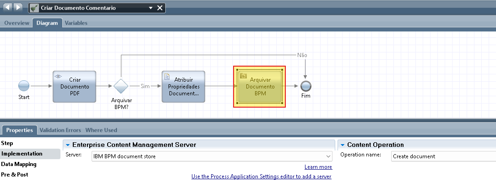
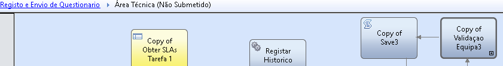
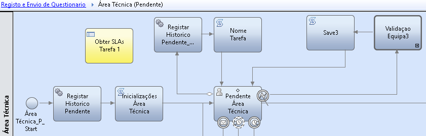
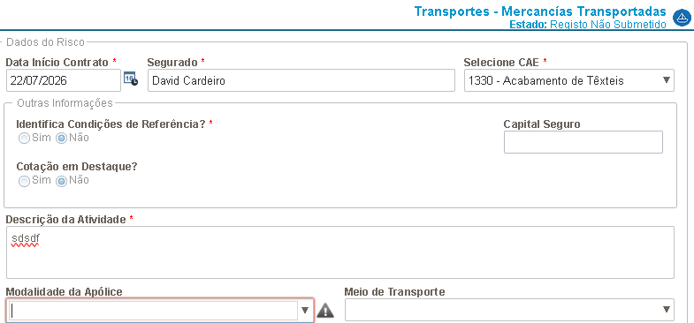
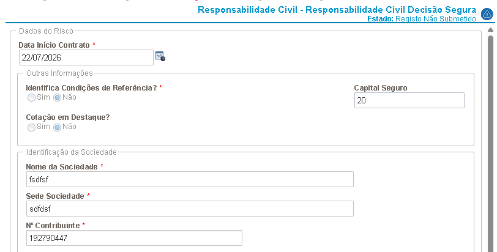
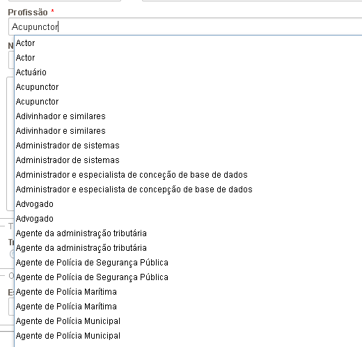
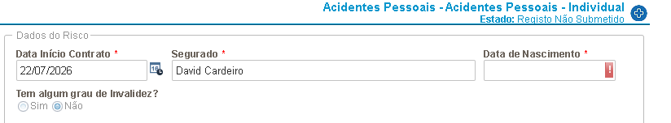
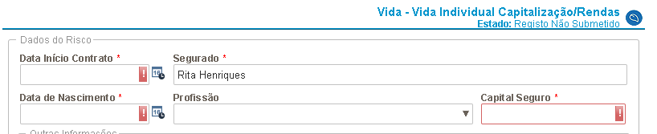

[Índice](./index.md) | 
[Processo de Cotações](./ProcessoCotacoes.md) | 
[Toolkits](./Toolkits.md)  

# [PC] Processos de Cotacoes

## BPD Fixes (after conversion)

### Analise de Produto em Cotacao
- Multiple paths: Análise Técnica -> Análise de Risco/Clínica
  - Combined paths: Path with condition 'tw.local.pAccao == "Analise Risco", appended  ' || tw.local.pAccao == "Aceitação Clínica"'
  - FIXED-BPD: Combined conditions on same path

### Simulacao com Pedido de Aceitacao
- Multiple paths: Aceitação Técnica -> AtualizaEstadoSimulador_2
  - Combined paths: Path with condition '(tw.local.pAcao=="Rejeicao" || (tw.local.pAcao=="Submeter Decisão" && tw.local.pEstadoCotacao.Status=="REJECTED"))", appended with  ' || (tw.local.pAcao=="Pedir Cotacao")', and appended with ' ||  (tw.local.pAcao== "Converter Processo Cotações")'
  - FIXED-BPD: Combined conditions on same path

### Renegociacao de Contrato
- Multiple paths: Revisão Comercial -> Análise Técnica
  - Combined paths: Path with condition 'tw.local.pAcao == "ValidadeExpirada"', appended with  ' || tw.local.pAcao == "Solicitar Reavaliacao"'
  - FIXED-BPD: Combined conditions on same path

### Analise de Produto em Cotacao > Analise Tecnica
- Volta para a mesma tarefa, após submissão, e anexação de documento cotação por comentário
  Aplicada logica de retorno à tarefa, em caso de erro ocorrido durante tarefa "Análise Técnica do Pedido (COT Recepção e Análise do Pedido)".    
  - Após debug do erro, chegou-se à conclusão que a origem está em COT Recepção e Análise do Pedido > Gerar Documento > Criar Documento Comentario > Arquivar Documento BPM  

    **`Criar Documento Comentario`**
    )
    
      
    **`XML error ECM `**
    ```xml
    <cause type="com.ibm.bpm.integration.core.CreateLocalDocumentNotAllowedException" description="CreateLocalDocumentNotAllowedException">
      <HTTPStatus type="java.lang.Integer" description="Integer">409</HTTPStatus>
      <cause type="java.lang.Throwable" description="cause"></cause>
      <code type="java.lang.Integer" description="Integer">409
      <localizedMessage type="java.lang.String" description="String">CWTBI0051E: A local document cannot be added to the 'Processo de Cotações:COT2026001741' instance with the '2072.71507' identifier. The instance has no BPM folder that allows adding local documents. The model of the 'Pedido de Cotações' process is found in the 'Tip' snapshot of the 'Processos de Cotacoes ' process application.</localizedMessage>
      <message type="java.lang.String" description="String">CWTBI0051E: A local document cannot be added to the 'Processo de Cotações:COT2026001741' instance with the '2072.71507' identifier. The instance has no BPM folder that allows adding local documents. The model of the 'Pedido de Cotações' process is found in the 'Tip' snapshot of the 'Processos de Cotacoes ' process application.</message>
      <messageID type="java.lang.String" description="String">CWTBI0051E</messageID>
      <messageKey type="java.lang.String" description="String">CreateLocalDocumentNotAllowed</messageKey>
      <messageVariables type="[Ljava.lang.Object;" description="Object;">
        <element type="java.lang.String" description="String">Processo de Cotações:COT2026001741</element>
        <element type="java.lang.String" description="String">2072.71507</element>
        <element type="java.lang.String" description="String">Pedido de Cotações</element>
        <element type="java.lang.String" description="String">Tip</element>
        <element type="java.lang.String" description="String">Processos de Cotacoes </element>
      </messageVariables> 
    </code>
    ```
  - TODO: ...

### Alteracoes ao Contrato
- Multiple paths on Decision: Requer Análise Técnica -> Serviço - Envio Notificações  
- TODO:   
      
  **`Decision Requer Análise Técnica`**  
  


### Avaliacao de Risco Pessoais
- (Converted) Process inside BPDs  
  > Cannot call linked process Tratamento Erro as it was converted from a BPD to a process. Convert this BPD to a process, or revert Tratamento Erro to a BPD from a previous snapshot.

  **`Aceitacao Clinica`**  
    
  **`Analise Documentacao`**  
    
  **`Marcacao Exames`**  
    
  **`Registo Informacao`**  
   

  - NOT-APPLY: *"não é usado, não é necessário migrar"*

### Registo Assinatura Digital
- (Converted) Process inside BPDs
  > Cannot call linked process Tratamento Erro as it was converted from a BPD to a process. Convert this BPD to a process, or revert Tratamento Erro to a BPD from a previous snapshot.

  **`Execucao`**  
    
  **`Submisssao`**  
   

  - NOT-APPLY: *"não é usado, não é necessário migrar"*

### Registo e Envio Questionario
- (Converted) Process inside BPDs
  > Cannot call linked process Tratamento Erro as it was converted from a BPD to a process. Convert this BPD to a process, or revert Tratamento Erro to a BPD from a previous snapshot.

  **`Area Tecnica`**  
    
  **`Area Tecnica Pendente`**  
    

  - NOT-APPLY: *"não é usado, não é necessário migrar"*

### Formularios de Risco < Pedido de Cotacao
- Modalidade Apólice requerida (mas não assinalada)  
  
  - NOT-APPLY: *"deve ser uma inconsistência já existente
deve estar em produção já assim. Confirmado que não é um comportamento igual ao de Produção, porque esse formulário de risco só existe em DEV
(ainda não foi disponibilizado nos outro ambientes). Portanto estas validação que é feita no server-side, mas que não está assinalada no formulário, pode ser desconsiderada (é um tema em nada relacionado com a migração)"*

- Erro ao validar Contribuinte, não deixa avançar  
  
  - NOT-APPLY: *"a rever, não percebo o porquê. Esse formulário, é um formulário que apenas existe em ambiente de desenvolvimento, por isso não deve ser considerado como erro associado à migração. [esse formulário diz respeito a uma melhoria que foi iniciada, mas que nunca foi depois terminada, por isso não chegou ao ambiente de produção, nem sei se algum dia vai chegar. Erro/inconsistência pode ser desconsiderada (é um tema em nada relacionado com a migração)"*

- Registos duplicados em dropdowns  
  
  - NOT-APPLY: *"tem a ver com a forma/campos com que é chamado o serviço que retorna essa informação. Rever o mapeamento no serverside. deve estar em Produção assim já. Revi o mapeamento no serverside, que é feito para chamar o serviço e não está correto, o que justifica o comportamento dos duplicados. Comportamento não se deve à migração, já está assim em Produção"*

- Controle "Data Nascimento" não é datepicker   
  
  - NOT-APPLY: *"sim, esse caso é normal, foi um pedido da área para ser texto e não dateTimePicker"*


- Evidenciados erros validação, logo ao iniciar ecra
  
  - NOT-APPLY: *"Responsabilidade Civil - Responsabilidade Civil Decisão Segura este como te disse, é para descartar, igualmente para o Mercancias Temporarias. Estes dois podes colocar como sem efeito. Não estão em uso atualmente. deixa-me ver esses outros casos que identificas. Os dois de Vida. para os outros formulários de risco, repliquei em Qualidade, e o comportamento é o mesmo. Haverá uma justificação para isso, e tenho uma suspeita, mas eves descartar também nestes dois formulários de vida o tema, como sendo decorrente da migração."*


## VALIDATION - Client-Side Human Service(1 error)
### TESTE_OBTER_PRODUTOS(1 error)
- The output mapping on element Copy of Obter Produtos CPU does not map to the correct type for variable pInsuranceTypesCPU.  
  - Removed output mapping
## VALIDATION - Heritage Human Service(6 errors, 64 warnings)
### ALC Aceitacao Condicoes(1 warning)
- The nested service 'Fim Aceitacao Condicoes' has end events that are not wired in service 'ALC Aceitacao Condicoes'.
  - NOT-FIXED: Occurs on non converted services, even if connected to flow
### ALC Detalhe Pesquisa EDUARDO(1 warning)
- The nested service 'Inicialização - ALC Detalhe Pesquisa' has end events that are not wired in service 'ALC Detalhe Pesquisa EDUARDO'.
  - NOT-FIXED: Occurs on non converted services, even if connected to flow
### ALC Submissao Documento(1 warning)
- The nested service 'Submeter Estado dos Documentos' has end events that are not wired in service 'ALC Submissao Documento'.
  - NOT-FIXED: Occurs on non converted services, even if connected to flow
### COT Adicao de Produto ao Pedido de Cotacao(1 warning)
- The nested service 'Inicialização - Introdução do Pedido de Cotação' has end events that are not wired in service 'COT Adição de Produto ao Pedido de Cotação '.
  - NOT-FIXED: Occurs on non converted services, even if connected to flow
### COT Detalhe Pesquisa(1 warning)
- No input parameter mapping found for parameter without default: Utilizador
  - Changed input to null
### COT Detalhe Pesquisa EDUARDO(3 warnings)
- No input parameter mapping found for parameter without default: Utilizador
  - Changed input to null
- No input parameter mapping found for parameter without default: iChaveProcesso
  - Changed input to null
- No input parameter mapping found for parameter without default: iListaProdutosReabertura
  - Changed input to null
### COT Detalhe Pesquisa Historizado(2 warnings)
- No input parameter mapping found for parameter without default: Utilizador
  - Changed input to null
- No input parameter mapping found for parameter without default: iListaProdutosReabertura
  - Changed input to null
### COT Introdução do Pedido de Cotação(1 warning)
- No input parameter mapping found for parameter without default: DadosTomadorPesquisa
  - Changed input to null
### COT Introdução do Pedido de Cotação BACKUP EDUARDO(1 warning)
- No input parameter mapping found for parameter without default: DadosTomadorPesquisa
  - Changed input to null
### COT Recepcao Analise da Cotacao e Submissao Proposta(4 warnings)
- The nested service 'Copy of Adicionar Produto ao Pedido de Cotação' has end events that are not wired in service 'COT Recepção Análise da Cotação e Submissão Proposta'.
  - Connected to flow item "Fim"
- The nested service 'Remover Documento Proposta' has end events that are not wired in service 'COT Recepção Análise da Cotação e Submissão Proposta'.
  - Connected to flow item "Fim"
- The nested service 'Submeter Estado dos Documentos' has end events that are not wired in service 'COT Recepção Análise da Cotação e Submissão Proposta'.
  - NOT-FIXED: Occurs on non converted services, even if connected to flow
- The nested service 'Terminar - Submissão do Documento Proposta' has end events that are not wired in service 'COT Recepção Análise da Cotação e Submissão Proposta'.
  - NOT-FIXED: Occurs on non converted services, even if connected to flow
### COT Recepcao e Analise da Cotacao(1 warning)
- The nested service 'Terminar - Recepção e Análise da Cotação' has end events that are not wired in service 'COT Recepção e Análise da Cotação'.
  - NOT-FIXED: Occurs on non converted services, even if connected to flow
### COT Recepção e Análise do Pedido(2 warnings)
- The nested service 'GetBlackList' has end events that are not wired in service 'COT Recepção e Análise do Pedido'.
  - Connected to flow item "Fim"
- No input parameter mapping found for parameter without default: iListaDocumentosIdAdicionais
  - Changed input to null
### COT Resposta ao Pedido de Esclarecimento(1 error)
- custom visibility botoes contains one or more JavaScript syntax errors.
  - Commented all script code
### Finalização - SPA Aceitacao Tecnica(1 warning)
- The nested service 'Copy of Serviço - Envio Notificações(Conversão)' has end events that are not wired in service 'Finalização - SPA Aceitacao Tecnica'.
  - Connected to flow item "Fim"
### Formulário de Risco - Pessoa Segura(1 error)
- Untitled1 contains one or more JavaScript syntax errors.
  - Removed error line (28)
### Formulário Registo Assinatura Digital(2 errors, 1 warning)
- No input parameter mapping found for parameter without default: iDocumentName
  - Changed input to null
- Attached service is unreachable.
  - Removed item "TESTE Merge" with unavailable service
- Merge PDF Binary and Static 2 is unreachable: 
[attachedProcessRef:80485488-4913-4d4e-b8a6-995bc82655c7]. Make sure it exists in the process application or toolkit. If it exists in another toolkit, ensure that the toolkit is included as a dependency.
  - Removed item "TESTE Merge" with unavailable service
### Formulário Risco - Vida ARP Marisa(1 warning)
- No input parameter mapping found for parameter without default: iProduto
  - Changed input to null
### Informacao de Gestao(3 warnings)
- No input parameter mapping found for parameter without default: iListaFiltros
  - Changed input to null
- No input parameter mapping found for parameter without default: iListaParametros
  - Changed input to null
- No input parameter mapping found for parameter without default: iRelatorioDetalheIG
  - Changed input to null
### Informacao de Gestao COT(2 warnings)
- No input parameter mapping found for parameter without default: iAgenteMestre
  - Changed input to null
- No input parameter mapping found for parameter without default: iRelatorioDetalheIG
  - Changed input to null
### obterSubstado(1 warning)
- The nested service ' get Delegacoes' has end events that are not wired in service 'obterSubstado'.
  - Connected to flow item "End"
### Pesquisa COT(1 warning)
- The nested service 'TESTE validacao' has end events that are not wired in service 'Pesquisa COT'.
Pesquisa COT
  - Connected to flow item coach "Pesquisa COT"
### Pesquisa COT Antiga(1 warning)
- The nested service 'TESTE validacao' has end events that are not wired in service 'Pesquisa COT Antiga'.
  - Connected to flow item coach "Pesquisa COT"
### Pesquisa COT BackUp Erro PRD(1 warning)
- The nested service 'TESTE validacao' has end events that are not wired in service 'Pesquisa COT BackUp Erro PRD'.
  - Connected to flow item coach "Pesquisa COT"
### Pesquisa COT Old(1 warning)
- The nested service 'TESTE validacao' has end events that are not wired in service 'Pesquisa COT Old'.
  - Connected to flow item coach "Pesquisa COT"
### Pesquisa COT Processar Processos BackOffice(1 warning)
- The nested service 'TESTE validacao' has end events that are not wired in service 'Pesquisa COT Processar Processos BackOffice'.
  - Connected to flow item coach "Pesquisa COT"
### Pesquisa COT Recuperacao(2 warnings)
- The nested service 'TESTE validacao' has end events that are not wired in service 'Pesquisa COT Recuperacao'.
  - Connected to flow item coach "Pesquisa COT Historização"
- No input parameter mapping found for parameter without default: iTipoOperacao
  - Changed input to null
### Pesquisa COT teste edu consentimentos(1 error, 1 warning)
- The nested service 'TESTE validacao' has end events that are not wired in service 'Pesquisa COT teste edu consentimentos'.
  - Connected to flow item coach "Pesquisa COT"
- SPA Aceitacao Planos 2 is unreachable: [64.57dc306c-24e3-4a1f-86a6-8e48ca242139:57dc306c-24e3-4a1f-86a6-8e48ca242139]. Make sure it exists in the process application or toolkit. If it exists in another toolkit, ensure that the toolkit is included as a dependency.
  - Removed unavailable view from coach
### Pesquisa COT teste edu documentos(1 warning)
- The nested service 'TESTE validacao' has end events that are not wired in service 'Pesquisa COT teste edu documentos'.
  - Connected to flow item coach "Pesquisa COT"
### Pesquisa COT teste edu documentos PMPAT(1 warning)
- The nested service 'TESTE validacao' has end events that are not wired in service 'Pesquisa COT teste edu documentos PMPAT'.
  - Connected to flow item coach "Pesquisa COT"
### Pesquisa Processos Abertos Old(1 warning)
- No input parameter mapping found for parameter without default: iPerfil
  - Changed input to null
### Pesquisa Processos de Cotações Ativos - Transversal(1 warning)
- The nested service 'TESTE validacao' has end events that are not wired in service 'Pesquisa Processos de Cotações Ativos - Transversal'.
  - Connected to flow item coach "Pesquisa COT Ativos"
### Pesquisa Processos Geral Otimizacao(1 warning)
- No input parameter mapping found for parameter without default: iAcao
  - Changed input to null
### Pesquisa REN Antiga(1 warning)
- No input parameter mapping found for parameter without default: iPerfil
  - Changed input to null
### Pesquisa REN Old(1 warning)
- No input parameter mapping found for parameter without default: iPerfil
  - Changed input to null
### Pesquisa SPA Processar Processos BackOffice(1 error, 16 warnings)
- The nested service 'Serviço - Pesquisa Simulacoes (Portal Search)' has end events that are not wired in service 'Pesquisa SPA Processar Processos BackOffice'.  
  - Connected to flow item StayOnPage "Manter Página"
- The nested service 'WS_Cancel_Quote' has end events that are not wired in service 'Pesquisa SPA Processar Processos BackOffice'.
  - Connected to flow item StayOnPage "Manter Página"
- The nested service 'WS_UpdatePoliciesWorkflow' has end events that are not wired in service 'Pesquisa SPA Processar Processos BackOffice'.
  - Connected to flow item StayOnPage "Manter Página"
- No input parameter mapping found for parameter without default: ApplicationCode
  - Changed input to null
- No input parameter mapping found for parameter without default: BarCode
  - Changed input to null
- No input parameter mapping found for parameter without default: ObjectWFId
  - Changed input to null
- No input parameter mapping found for parameter without default: PolicyNumber
  - Changed input to null
- No input parameter mapping found for parameter without default: PolicyWorkflowId
  - Changed input to null
- No input parameter mapping found for parameter without default: PolicyWorkflowStatusCode
  - Changed input to null
- No input parameter mapping found for parameter without default: PolicyWorkflowStatusDetailCode
  - Changed input to null
- No input parameter mapping found for parameter without default: PolicyWorkflowStatusDetailMessage
  - Changed input to null
- No input parameter mapping found for parameter without default: PolicyWorkflowStatusMessage
  - Changed input to null
- No input parameter mapping found for parameter without default: ProcessId
  - Changed input to null
- No input parameter mapping found for parameter without default: SubProcessId
  - Changed input to null
- No input parameter mapping found for parameter without default: UserId
  - Changed input to null
- No input parameter mapping found for parameter without default: WorkflowType
  - Changed input to null
- PortalSearchOffer is unreachable: [classId:4590144d-cf98-4dbc-a92f-47788ce40cd0]. Make sure it exists in the process application or toolkit. If it exists in another toolkit, ensure that the toolkit is included as a dependency.
  - Changed variable type to ANY(list)
### Registo Processo Simples BPM (Assinatura Digital)(1 warning)
- The nested service 'Formulário Registo Assinatura Digital' has end events that are not wired in service 'Registo Processo Simples BPM (Assinatura Digital)'.
  - NOT-FIXED: Occurs on non converted services, even if connected to flow
### REP Detalhe Pesquisa EDUARDO(1 warning)
- The nested service 'Inicialização - REP Detalhe Pesquisa' has end events that are not wired in service 'REP Detalhe Pesquisa EDUARDO'.
  - NOT-FIXED: Occurs on non converted services, even if connected to flow
### Serviço - Abre Ecra Detalhe Processo(1 warning)
- No input parameter mapping found for parameter without default: iPerfil
  - Changed input to null
### Serviço - Abrir Detalhe Relatorios(1 warning)
- No input parameter mapping found for parameter without default: iChaveProcesso
  - Changed input to null
### Teste erro FileStorage UpgradeBPM(1 warning)
- The nested service 'TESTE validacao' has end events that are not wired in service 'Teste erro FileStorage UpgradeBPM'.
  - Connected to flow item coach "Pesquisa COT Historização"
## VALIDATION - Process(11 warnings)
### Análise de Produto em Cotação(1 warning)
- No input parameter mapping found for parameter without default: iteste
  - Changed input to null
### Pedido de Cotações(10 warnings)
- No input parameter mapping found for parameter without default: iAgenteSimulacao
  - Changed input to null
- No input parameter mapping found for parameter without default: iDataSimulacao
  - Changed input to null
- No input parameter mapping found for parameter without default: iDataValidadeSimulacao
  - Changed input to null
- No input parameter mapping found for parameter without default: iIDProduto
  - Changed input to null
- No input parameter mapping found for parameter without default: iIdxProduto
  - Changed input to null
- No input parameter mapping found for parameter without default: iLinhaNegocioSimulacao
  - Changed input to null
- No input parameter mapping found for parameter without default: iNifTomador
  - Changed input to null
- No input parameter mapping found for parameter without default: iNomeTomador
  - Changed input to null
- No input parameter mapping found for parameter without default: iNumeroSimulacao
  - Changed input to null
- No input parameter mapping found for parameter without default: iURLSimulacao
  - Changed input to null
## VALIDATION - Service Flow(35 warnings)
### GetPedidoCotacaoData Recuperacao JSON(2 warnings)
- No input parameter mapping found for parameter without default: profile
  - Changed input to null
- No input parameter mapping found for parameter without default: userId
  - Changed input to null
### Merge PDF Binary and Static(6 warnings)
- The nested service 'Get Document CDU' has end events that are not wired in service 'Merge PDF Binary and Static'.
  - Connected to flow item "End"
- No input parameter mapping found for parameter without default: ApplicationCode
  - Changed input to null
- No input parameter mapping found for parameter without default: Code
  - Changed input to null
- No input parameter mapping found for parameter without default: Date
  - Changed input to null
- No input parameter mapping found for parameter without default: Id
  - Changed input to null
- No input parameter mapping found for parameter without default: WebUser
  - Changed input to null
### RAD Formulario Registo Inicializar Documentos(12 warnings)
- The nested service 'Merge PDF Binary and Static' has end events that are not wired in service 'RAD Formulario Registo Inicializar Documentos'.
  - Connected to flow item "End"
- The nested service 'Obter Documento e Propriedades BPM por ID' has end events that are not wired in service 'RAD Formulario Registo Inicializar Documentos'.
  - Connected to flow item "End"
- The nested service 'RAD Upload Document FileSystem' has end events that are not wired in service 'RAD Formulario Registo Inicializar Documentos'.
  - Connected to flow item "End"
- No input parameter mapping found for parameter without default: iApplicationCode
  - Changed input to null
- No input parameter mapping found for parameter without default: iDocumentName
  - Changed input to null
- No input parameter mapping found for parameter without default: iDocumentoBase64
  - Changed input to null
- No input parameter mapping found for parameter without default: iListaDocumentosEstaticos
  - Changed input to null
- No input parameter mapping found for parameter without default: iMimeType
  - Changed input to null
- No input parameter mapping found for parameter without default: iProcessType
  - Changed input to null
- No input parameter mapping found for parameter without default: iTipoDocumento
  - Changed input to null
- No input parameter mapping found for parameter without default: iTipoProcesso
  - Changed input to null
- No input parameter mapping found for parameter without default: ioDocumentoOriginal
  - Changed input to null
### Registo Processo Simples Inicializações RAD(8 warnings)
- The nested service 'Obter Documento e Propriedades BPM por ID' has end events that are not wired in service 'Registo Processo Simples Inicializações RAD'.
  - Connected to flow item "End"
- The nested service 'RAD Upload Document FileSystem' has end events that are not wired in service 'Registo Processo Simples Inicializações RAD'.
  - Connected to flow item "End"
- No input parameter mapping found for parameter without default: iApplicationCode
  - Changed input to null
- No input parameter mapping found for parameter without default: iDocumentName
  - Changed input to null
- No input parameter mapping found for parameter without default: iDocumentoBase64
  - Changed input to null
- No input parameter mapping found for parameter without default: iMimeType
  - Changed input to null
- No input parameter mapping found for parameter without default: iProcessType
  - Changed input to null
- No input parameter mapping found for parameter without default: iTipoDocumento
  - Changed input to null
### Serviço _ RAD Finalizar SubProcesso(1 warning)
- The nested service 'Copy of Registar Histórico Final' has end events that are not wired in service 'Serviço _ RAD Finalizar SubProcesso'.
  - Connected to flow item "End"
### Serviço - RAD Inicializar SubProcesso(1 warning)
- The nested service 'Copy of Registar Histórico' has end events that are not wired in service 'Serviço - RAD Inicializar SubProcesso'.
  - Connected to flow item "End"
### Serviço Historização_Apagar Instancias BPM(1 warning)
- The nested service 'Delete TESTE' has end events that are not wired in service 'Serviço Historização_Apagar Instancias BPM'.
  - Connected to flow item "End"
### Serviço Historização_Processar Processos Expurgo(4 warnings)
- The nested service 'Delete Instances TESTE' has end events that are not wired in service 'Serviço Historização_Processar Processos Expurgo'.
  - Connected to flow item "End"
- The nested service 'Registar Resultado Replicação' has end events that are not wired in service 'Serviço Historização_Processar Processos Expurgo'.
  - Connected to flow item "End"
- The nested service 'VALIDAR EXPURGO' has end events that are not wired in service 'Serviço Historização_Processar Processos Expurgo'.
  - Connected to flow item "End"
- No input parameter mapping found for parameter without default: iTipoOperacao
  - Changed input to null
